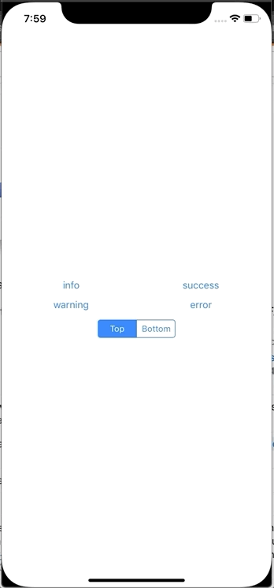

[](https://travis-ci.org/ArtemovRM/ARNotification)

# ARNotification 

Lightweight notification for iOS written in Swift 

## Requirements

iOS 9.0+

## Install
###### Via CocoaPods.

To install ARNotification with CocoaPods, add the following lines to your Podfile: 
```
pod 'ARNotification'
```

## Example

For example, set a window for notifications in didFinishLaunchingWithOptions

``` swift
import ARNotification

func application(_ application: UIApplication, didFinishLaunchingWithOptions launchOptions: [UIApplication.LaunchOptionsKey: Any]?) -> Bool {
  // Override point for customization after application launch.
  ARNotification.shared.window = self.window
  
  var settings = ARNotificationSettings()
  settings.position = ARNotificationPosition.bottom
		
  ARNotification.shared.settings = settings
  
  return true
}
```

Next

``` swift
ARNotification.shared.push(type: .error, title: "Unknown error")
``` 


